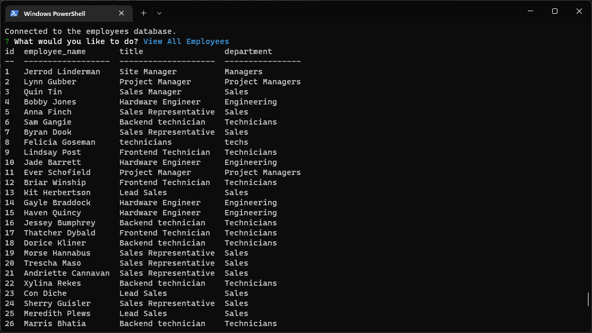

  

  
  

  

  
  ## Jerrod Linderman

  

  

  
  

  
  
  <h1 align="center">Badges</h1>
  

  

  
  

  
  
  
  

  

  
  <h1 align="center">
  
  Employee Tracker</h1>

  

  Video Link:
  https://drive.google.com/file/d/1AB6HfUOGyGwyd-TXPzvVx50gS3Q60ZXk/view?usp=sharing
 
  
  
  ## Table of Contents:
  1. [Description](#description)
  2. [Installation](#installation)
  3. [Usage](#usage)
  4. [How To Contribute](#contribute)
  5. [license](#license)
  6. [Tests](#tests)
  7. [Github](#github)
  8. [Email](#questions)

  ## Description
  Node command line based employee management system allowing basic commands to manage Employees Roles and Departments, updating roles, employee managers, departments and department roles. 

  ## Installation
  install npm packages Inquierer, MySqL2, Console.table.

  ## Usage
  Execute server.js from node in terminal, the user will be prompted with various menu items that can be run for vaious options to control the data with in the database for employees, departments and roles. 

 
  ## Contribute
  
  [Contributor Covenant](https://www.contributor-covenant.org/)

  At this time owner is not accepting any contributions to this project.

  ## License

  Published under the [MIT](license.txt) License.
  

  Read More about the licence by clicking this Link: [MIT](https://opensource.org/licenses/MIT).
 

  ## Tests
  no tests available.

  ## GitHub
  [nvmax](https://github.com/nvmax)

  ## Questions
  If you have any questions, please contact me by clicking the email link below:
  ### [nvmaxx@gmail.com](nvmaxx@gmail.com) 

 
